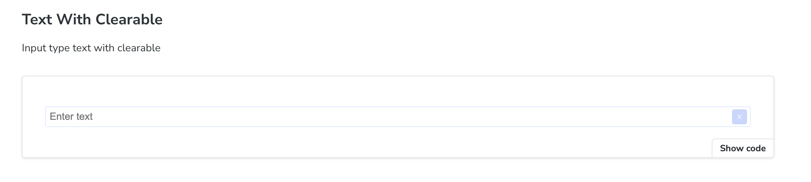
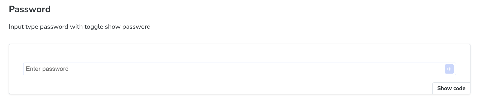
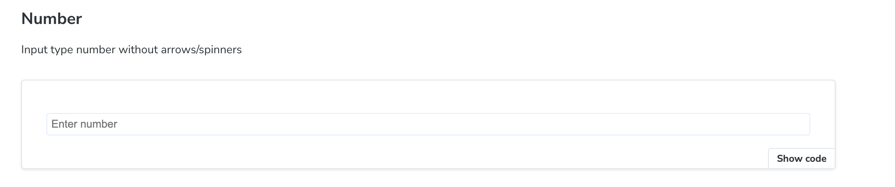
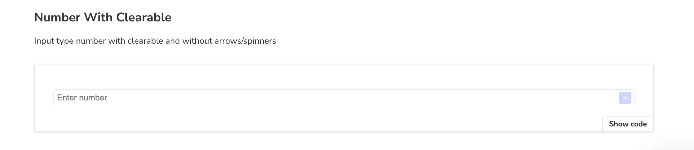
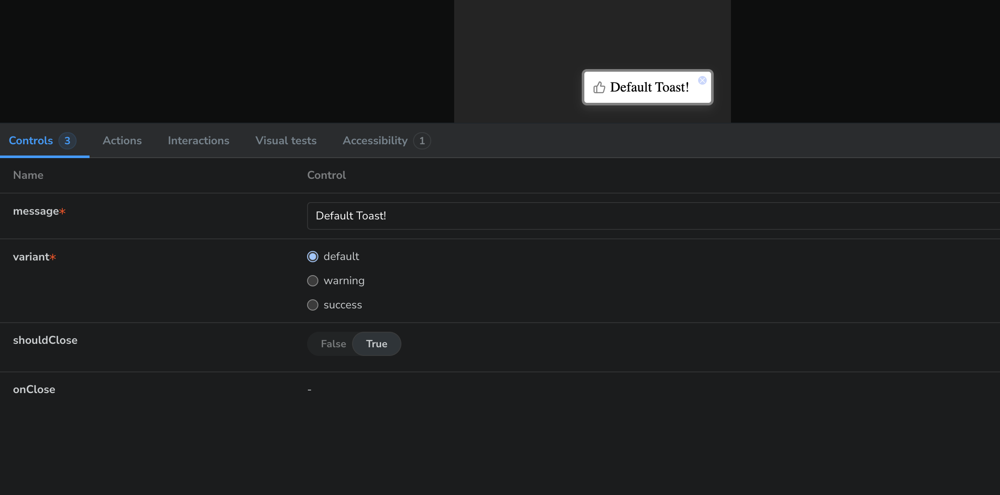
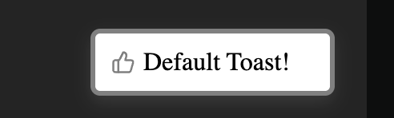
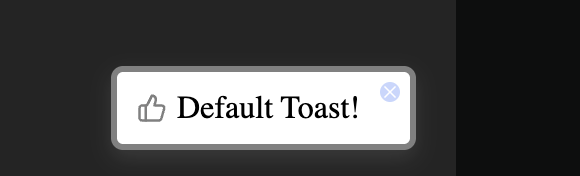
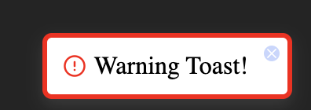
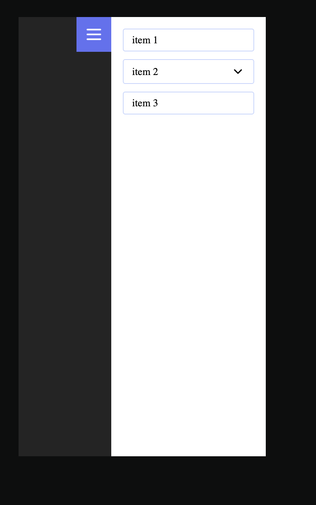
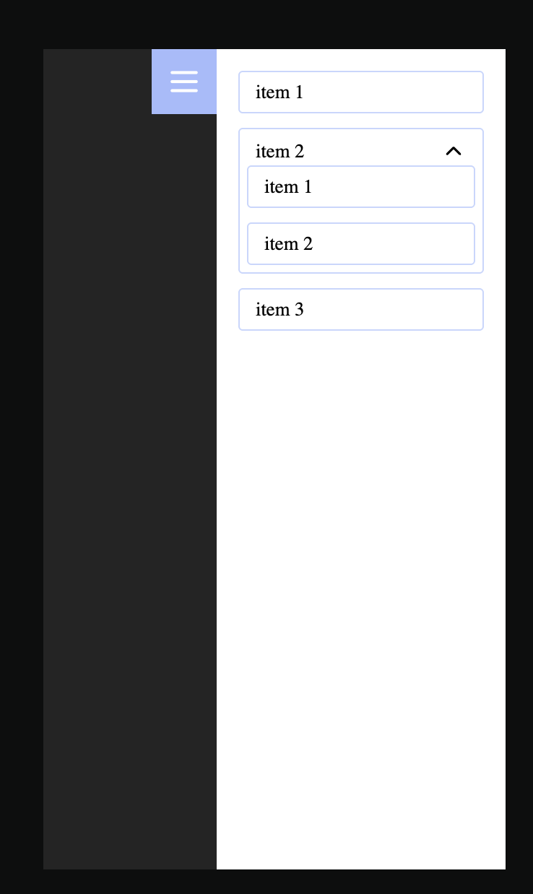

# 🧩 UI Library (`ui-lib`)

A modern, reusable component library built with **React 19**, **TypeScript**, **Vite**, and **Storybook**.  
Designed for scalability, documentation, and developer productivity.

---

## 🚀 Features

- ✅ React 19 + TypeScript
- 🎨 SCSS Modules for styling
- 🧠 Component-based architecture
- 📚 Integrated **Storybook** with Docs
- ✨ Prettier + ESLint for code quality
- 📦 Built using Vite (dev & build)


## 📦 Installation

```bash

git clone https://github.com/david-dya4yk/ui-lib.git
cd ui-lib
npm install

   Command                    Description                    

| `npm run dev`             | Run Vite dev server            |
| `npm run build`           | Build library                  |
| `npm run lint`            | Run ESLint                     |
| `npm run format`          | Format code with Prettier      |
| `npm run preview`         | Preview built project (Vite)   |
| `npm run storybook`       | Start Storybook on port `6006` |
| `npm run build-storybook` | Build static Storybook         |

🧱 Components Overview

✅ Input
Custom input with optional clear button and password toggle
Supports: text, password, number
Props:
isClearable?: boolean
iconSize?: 's' | 'm' | 'l'

🔔 Toast Usage
To use the toast system in your app:

1️⃣ Wrap your app with ToastProvider (usually in App.tsx or layout)
import { ToastProvider } from '@/components/Toast';

function App() {
  return (
    <ToastProvider>
      <YourApp />
    </ToastProvider>
  );
}
2️⃣ Use useToast() wherever you want to show a toast
import { useToast } from '@/components/Toast';

const showToast = useToast(3000); // Optional: pass custom timing (ms)

<button
  onClick={() => {
    showToast({
      message: 'Action completed successfully!',
      variant: 'success',     // e.g. success | error | info
      shouldClose: true       // auto-remove after timeout
    });
  }}
>
  Show Toast
</button>

✅ SidebarMenu
Slide-in sidebar with nested accordion items
Click outside to close
Recursive structure via items prop

```














